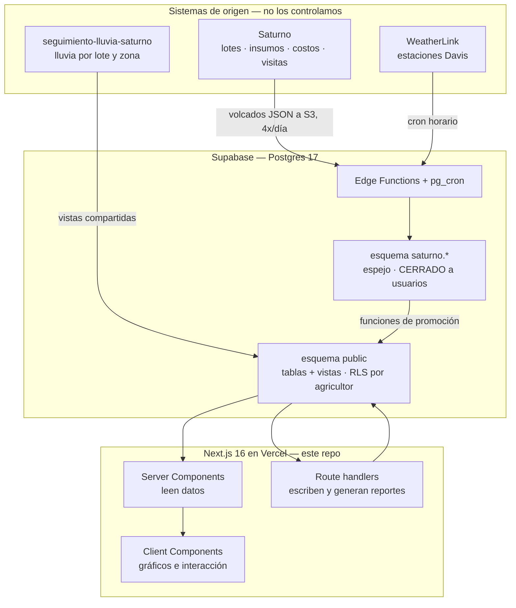
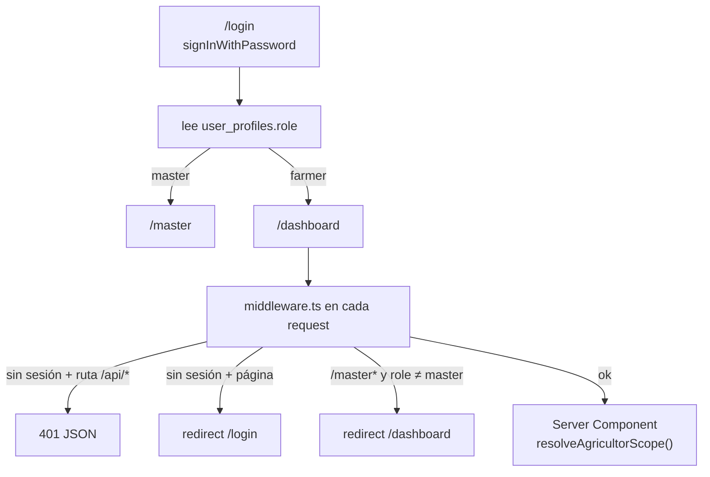

# Programa Saturno

Plataforma digital del **Programa de Agricultura por Contrato** de maíz blanco.
Reúne clima, cultivo y documentación de cada agricultor en una sola interfaz, tanto
para el equipo técnico como para los propios productores.

**Producción:** https://agri-platform-omega.vercel.app

| | |
|---|---|
| **Stack** | Next.js 16 (App Router) · React 19 · TypeScript · Tailwind CSS v4 · Supabase (Postgres 17) |
| **Despliegue** | Vercel — push a `main` despliega a producción |
| **Idioma** | Interfaz y documentación en español |
| **PWA** | Sí, instalable (Serwist) |

> **Nomenclatura.** El repositorio se llama `agri-platform` por razones históricas; el
> **producto** se llama **Programa Saturno**. "Polar" a secas se refiere a la empresa, y
> "Saturno" a secas al **sistema de origen de los datos** (ver §5.1) — no son lo mismo
> que el producto. Conviene no renombrar nada de esto.

---

## Índice

1. [Para quién es este documento](#1-para-quién-es-este-documento)
2. [Qué hace la plataforma](#2-qué-hace-la-plataforma)
3. [Puesta en marcha](#3-puesta-en-marcha)
4. [Arquitectura](#4-arquitectura)
5. [De dónde viene la data](#5-de-dónde-viene-la-data)
6. [Modelo de datos](#6-modelo-de-datos)
7. [Autenticación y autorización](#7-autenticación-y-autorización)
8. [Mapa de rutas](#8-mapa-de-rutas)
9. [Estructura del repositorio](#9-estructura-del-repositorio)
10. [La capa `lib/`](#10-la-capa-lib)
11. [Stack y dependencias](#11-stack-y-dependencias)
12. [PWA](#12-pwa)
13. [Seguridad](#13-seguridad)
14. [Rendimiento](#14-rendimiento)
15. [Operación y mantenimiento](#15-operación-y-mantenimiento)
16. [Convenciones de código](#16-convenciones-de-código)
17. [Integrar este repositorio en otro proyecto](#17-integrar-este-repositorio-en-otro-proyecto)
18. [Trampas conocidas](#18-trampas-conocidas)
19. [Estado y pendientes](#19-estado-y-pendientes)
20. [Índice de documentación](#20-índice-de-documentación)

---

## 1. Para quién es este documento

Este README es la puerta de entrada para **alguien que no ha trabajado antes en el
proyecto** y necesita entender de dónde sale cada dato, cómo está organizado el código
y qué no debe romper. La documentación está repartida así:

| Documento | Cuándo leerlo |
|---|---|
| **Este README** | Primero. Panorama completo e integración. |
| [`AGENTS.md`](AGENTS.md) | **Antes de escribir código.** Reglas duras y trampas que ya costaron caro. |
| [`docs/ARQUITECTURA.md`](docs/ARQUITECTURA.md) | Decisiones de fondo, flujo de datos, modelo de acceso. |
| [`docs/COMPONENTES.md`](docs/COMPONENTES.md) | Mapa de la interfaz: qué pantalla monta qué. |
| [`docs/INTEGRACION_WEATHERLINK.md`](docs/INTEGRACION_WEATHERLINK.md) | Todo sobre la conexión a WeatherLink: API, sensores, incidentes. |
| [`docs/OPERACION_PIPELINE_CLIMA.md`](docs/OPERACION_PIPELINE_CLIMA.md) | Runbook operativo del clima: health-checks y procedimientos. |
| [`docs/SINCRONIZACION_SATURNO.md`](docs/SINCRONIZACION_SATURNO.md) | Cómo se espejan los datos operativos desde Saturno. |

> Si vienes a **integrar este repo en otro proyecto**, salta directo a
> [§17](#17-integrar-este-repositorio-en-otro-proyecto): explica qué está en el repo y
> qué vive fuera de él (que es bastante).

---

## 2. Qué hace la plataforma

### Módulos

| Ruta | Módulo | Qué hace |
|---|---|---|
| `/dashboard` | Inicio | KPIs del ciclo, tabla de lotes, centro de novedades, comunicaciones |
| `/clima` | Clima | Lectura actual, temperatura, lluvia por lote y zona, predicción, alertas, histórico exportable |
| `/cultivo` | Cultivo | Línea de tiempo por lote, etapa fenológica del maíz, suelo e insumos |
| `/documentacion` | Documentación | Análisis de suelo, convenios y estado de resultados (P&L) |
| `/master` | Consola | Validación: qué ve cada usuario, con acceso directo a su vista |

### Roles

Hay **dos roles** y **un solo código**: no existen pantallas separadas por rol.

| Rol | Alcance |
|---|---|
| `farmer` | Ve exclusivamente sus propios datos. Lo garantiza la RLS de Postgres, no el frontend. |
| `master` | Consola de validación: elige un agricultor con `?agricultor=<KEY>` y ve **exactamente** lo que ve ese agricultor. Además tiene vistas globales en `/clima` y permisos de escritura (subir documentos, corregir fechas de siembra). |

El parámetro `?agricultor=` se propaga entre pantallas desde el `Sidebar`. Para un
`farmer` el parámetro se **ignora** por diseño (`lib/access.ts`), así que manipular la
URL no expone nada.

### Ciclo agrícola

Todas las pantallas trabajan sobre el **ciclo agrícola activo**, hoy `2026`, definido en
un solo lugar (`lib/ciclo.ts` → `CICLO_ACTIVO`).

> **Detalle contraintuitivo:** `resolveCiclo()` **ignora deliberadamente** el `?ciclo=` de
> la URL y siempre devuelve el ciclo activo. Es una defensa contra PWAs instaladas que
> conservan enlaces cacheados a ciclos viejos. El parámetro se sigue aceptando en la URL
> para no romper esos enlaces, pero no cambia nada.

---

## 3. Puesta en marcha

### Requisitos

- **Node.js 20 o superior.** El repo fija `@types/node` en la línea 20; los scripts de
  mantenimiento usan `node --env-file`, que necesita 20.6+.
- **npm** (hay `package-lock.json`; no se usa pnpm ni yarn).
- Acceso a un **proyecto Supabase** ya provisionado con el esquema de la plataforma
  (ver la advertencia de [§17](#17-integrar-este-repositorio-en-otro-proyecto): el
  esquema **no está en este repo**).

### Instalación

```bash
npm install
cp .env.example .env.local   # y rellenar los valores
npm run dev                  # http://localhost:3000
```

### Variables de entorno

La plantilla completa y comentada está en [`.env.example`](.env.example). En resumen:

| Variable | Ámbito | Para qué |
|---|---|---|
| `NEXT_PUBLIC_SUPABASE_URL` | Cliente + servidor | URL del proyecto Supabase |
| `NEXT_PUBLIC_SUPABASE_ANON_KEY` | Cliente + servidor | Clave pública; toda lectura pasa por RLS |
| `SUPABASE_SERVICE_ROLE_KEY` | **Solo servidor** | Escrituras y consultas cross-agricultor. **Bypassa la RLS.** |

Las credenciales de terceros (WeatherLink, buckets S3) **no van acá**: viven en los
secrets de Edge Functions y en Supabase Vault. Ver [§13](#13-seguridad).

### Comandos

```bash
npm run dev     # desarrollo (next dev --webpack)
npm run build   # build de producción (next build --webpack)
npm run start   # servir el build
npm run lint    # eslint
```

> **Por qué `--webpack` y no Turbopack:** Turbopack rompe la compilación del service
> worker de Serwist. El flag es intencional en ambos scripts; quitarlo rompe la PWA.

**No hay suite de pruebas automatizadas.** La verificación es manual: `npm run lint`,
`npm run build` (que corre el typecheck) y revisión en el navegador con un usuario de
cada rol.

### Problema frecuente: el typecheck falla tras borrar una página

Al eliminar una página, Next deja una referencia obsoleta en
`.next/dev/types/validator.ts` y el typecheck falla con un error que no apunta a nada
real. Solución:

```bash
Remove-Item -Recurse -Force .next   # PowerShell
rm -rf .next                        # bash
npm run build
```

### Despliegue

Push a `main` despliega a Vercel. **No hay staging**: lo que entra en `main` sale a
producción. Para verificar que un cambio llegó de verdad, ver
[ARQUITECTURA §8](docs/ARQUITECTURA.md#8-deploy-y-por-qué-a-veces-no-sale-a-producción)
— incluye el truco de leer `/sw.js` (es la única ruta pública) y la razón por la que el
plan Hobby de Vercel bloquea deploys de commits de no-colaboradores.

---

## 4. Arquitectura



### El principio que explica todo lo demás

> **La app no es dueña de casi ningún dato.**

Salvo lo que un usuario escribe explícitamente —fechas de siembra corregidas, documentos
cargados, tickets de soporte— todo se espeja desde sistemas externos. Dos consecuencias
prácticas:

1. **Antes de "arreglar" un dato faltante, hay que comprobar si el hueco ya viene del
   origen.** Es el error más común y el que más tiempo hace perder. El pipeline de clima
   documenta tres incidentes reales donde esa distinción fue todo
   ([INTEGRACION_WEATHERLINK §5](docs/INTEGRACION_WEATHERLINK.md#5-casos-reales-documentados-incidentes)).
2. **El frontend casi no escribe.** Lee vistas ya resueltas y presenta. La lógica pesada
   vive en Postgres (vistas, funciones de promoción) y en Edge Functions.

### Capas del código

| Carpeta | Responsabilidad | No debe |
|---|---|---|
| `app/(app)/*/page.tsx` | Server Components: piden datos y componen la pantalla | Contener lógica de negocio ni un `<h1>` (el título vive en la cabecera fija) |
| `app/api/*/route.ts` | Escrituras y generación de reportes | Existir para lecturas simples — eso lo hace el Server Component |
| `lib/*.ts` | Acceso a datos y reglas de negocio | Importar React |
| `components/*.tsx` | Presentación e interacción | Consultar la base directamente |

---

## 5. De dónde viene la data

```
Saturno (sistema origen)   ──4 volcados/día──►  esquema saturno.*  ──promoción──►  public.*  ──►  app
WeatherLink (45 estaciones)──cron horario────►  weather_readings   ─────────────►  vistas    ──►  app
seguimiento-lluvia-saturno ──vistas compartidas──────────────────────────────────►  app
```

### 5.1 Saturno — datos operativos

Es **la fuente de la verdad** de lotes, agricultores, insumos, mecanización, visitas
técnicas y costos. La app los espeja y **no los edita**.

Llegan como volcados JSON a un bucket S3 que vive en **otro proyecto Supabase**
(`nwouogywyofnvxsgjttd`), no en el nuestro. Las credenciales están en Vault
(`saturno_config()`).

```
S3 (proyecto ajeno) → edge function saturno-sync → esquema saturno.* → funciones de promoción → public.*
                                                   cron: 20 5,11,17,23 (cada 6 h)
```

El espejo guarda **todo como TEXT** y la traducción de columnas vive en
`saturno.mapa_columnas`. Detalle completo en
[SINCRONIZACION_SATURNO.md](docs/SINCRONIZACION_SATURNO.md).

Salud de la sincronización:

```sql
select * from public.v_saturno_salud;
```

### 5.2 WeatherLink — el único dato propio

El clima es lo único que la plataforma captura por sí misma, desde estaciones Davis vía
la **API v2 de WeatherLink**. Estaciones → `weather_readings`, mediante varias Edge
Functions (`weatherlink-sync`, `wl-load-historic`, `wl-sync-bulk`) coordinadas por cron
horario.

La asignación agricultor ↔ estación la resuelve la vista `v_clima_efectivo` probando
cuatro estrategias en orden: `override` → `auto_codigo_up` → `herencia_ciclo` →
`codigo_de_lote`.

> **Quien no tiene estación Davis ve el módulo vacío, no una estimación.** Hasta el
> 30-jul-2026 se estimaba por triangulación IDW desde las tres estaciones más cercanas,
> pero en pantalla eso se leía igual que una medición del propio lote. Se retiró en el
> `CASE` de `v_clima_efectivo` (migración `clima_sin_triangulacion`). La RPC
> `triangulate_clima()` y las coordenadas se conservan: revertir es reponer una rama del
> `CASE`. Ojo: partes de `docs/OPERACION_PIPELINE_CLIMA.md` describen el comportamiento
> anterior con triangulación activa.

Dos documentos, dos propósitos:

- **[`docs/INTEGRACION_WEATHERLINK.md`](docs/INTEGRACION_WEATHERLINK.md)** — cómo funciona
  la API, las dos generaciones de sensores (que **cambian los nombres de los campos**),
  la deduplicación por timestamp, el rate limiting, el mapeo estación por estación y los
  incidentes reales con su diagnóstico. **Lectura obligatoria antes de tocar el
  pipeline.**
- **[`docs/OPERACION_PIPELINE_CLIMA.md`](docs/OPERACION_PIPELINE_CLIMA.md)** — runbook:
  health-checks, dar de alta un agricultor o una estación, rotar la API key, overrides.

### 5.3 seguimiento-lluvia-saturno — lluvia por lote

Proyecto aparte, integrado en `/clima` mediante **vistas compartidas**
(`vista_prediccion_lluvia_lote`, `vista_lluvia_mensual_zona`, …) y el puente
`agricultor_lluvia_map`, que traduce `agropecuaria.AgricultorKey` → `agricultores.id`.

> El puente es **por id, nunca por nombre**.

Ese repositorio no se vendoriza acá (está excluido en `.gitignore`); solo se leyó como
fuente para portar componentes al módulo `/clima`.

---

## 6. Modelo de datos

Supabase / **Postgres 17**. Dos esquemas importan: `public` (lo que consume la app) y
`saturno` (el espejo, cerrado). Cifras aproximadas a jul-2026: ~49 tablas y ~36 vistas en
`public`, ~56 tablas espejo en `saturno`.

### 6.1 Tablas de `public` por dominio

**Identidad y acceso**

| Tabla | Contenido |
|---|---|
| `user_profiles` | `user_id` (FK a `auth.users`), `agricultor_key`, `role` (`farmer` \| `master`) |
| `agropecuaria` | Perfil del productor: `AgricultorKey`, nombre, `ciclo` |

**Producción**

| Tabla | Contenido |
|---|---|
| `lote` | Lotes del ciclo, con hectáreas, estado y fechas |
| `lote_derivado` | Datos derivados del espejo (fase, última visita, encalado, avance), materializados con RLS propia |
| `lote_eventos` | Bitácora de cambios manuales (p. ej. corrección de fecha de siembra) |
| `unidad_produccion` | Fincas: `codigo_up`, coordenadas |
| `producto_registro` | Insumos aplicados por lote. **Tiene columna `ciclo`: filtrar por ella** |
| `pl_unidad` | Costos del estado de resultados por finca |
| `rendimiento_agricultor` / `Rendimiento` | Rendimiento por agricultor |

**Clima**

| Tabla | Contenido |
|---|---|
| `weather_readings` | Lecturas Davis crudas (~cada 15 min). La tabla grande del sistema |
| `sync_status` | Progreso de sincronización por estación. **Si una estación no está acá, nunca se sincroniza** |
| `load_historic_queue` | Cola de backfill histórico |
| `clima_forecast` | Pronóstico a 7 días |
| `mapa_productor_clima` | Overrides manuales de asignación de estación |
| `estaciones_davis` | Catálogo de estaciones con coordenadas |

**Lluvia por lote** (proyecto integrado): `agricultor_lluvia_map`,
`lotes_seguimiento_lluvia`, `agricultores`.

**Documentos y soporte**

| Tabla | Contenido |
|---|---|
| `lote_analisis_suelo` | Metadatos de los documentos cargados (el archivo vive en Storage) |
| `tickets` | Buzón de preguntas de los agricultores |

### 6.2 Vistas que alimentan las pantallas

**No consultes `public.lote` directamente para el dashboard.** Estas vistas ya resuelven
derivaciones que no son obvias:

| Vista | Qué entrega |
|---|---|
| `v_lote_detalle` | Una fila por lote: ha plan / encaladas / sembradas / perdidas / cosechadas, estado, fase, última visita técnica, avance del ciclo |
| `v_agricultor_resumen` | Distribución de estados, fase dominante y avance medio por agricultor y ciclo |
| `v_clima_efectivo` | Asignación efectiva agricultor ↔ estación, con `fuente` y `match_type` |
| `v_saturno_salud` | Salud de la sincronización con Saturno |
| `v_pipeline_health`, `v_pipeline_health_detalle` | Salud del pipeline de clima |
| `vista_seguimiento_lluvia`, `vista_lluvia_diaria_lote`, `vista_lluvia_mensual_lote`, `vista_prediccion_lluvia_lote` | Lluvia por lote |
| `vista_lluvia_mensual_zona`, `vista_prediccion_lluvia_zona`, `vista_lluvia_diaria_estacion`, `vista_distribucion_normal_lluvia` | Lluvia por zona y distribución (master) |

Tres detalles de `v_lote_detalle` que sorprenden a todos:

- **"Ha encaladas" no existe como columna.** Se deriva sumando la mecanización de tipo
  `Pase de encaladora` aplicada al lote.
- **La fase viene medida en campo** (`saturno.seguimiento` → V1..V12, R1..R6), no
  calculada por días transcurridos. Es más fiable; prefiérela.
- **`avance_pct` es `null` para lotes sin sembrar, a propósito**: no deben arrastrar el
  promedio hacia abajo.

> **Ojo con la cosecha:** en el ciclo activo puede no haber ningún lote cosechado. Antes
> de graficar cosecha, comprobar que hay datos; si no, graficar avance de ciclo (es lo que
> hace `AvanceCultivoChart`).

### 6.3 Qué vista usa cada módulo

```
/dashboard      → v_lote_detalle · v_agricultor_resumen · lote_analisis_suelo · lote_eventos
                  + v_clima_efectivo · weather_readings · clima_forecast (vía lib/clima.ts)
/clima          → vistas vista_* de lluvia · agricultor_lluvia_map
                  + v_clima_efectivo · weather_readings
/cultivo        → lote · v_lote_detalle · producto_registro
                  + v_clima_efectivo · weather_readings
/documentacion  → lote_analisis_suelo · lote · agropecuaria · pl_unidad (P&L vía API)
/master         → user_profiles · agropecuaria · lote · lote_analisis_suelo · v_clima_efectivo
                  (todo con service_role)
```

### 6.4 Storage

| Bucket | Dónde | Para qué |
|---|---|---|
| `analisis-suelo` | Supabase Storage | PDFs e imágenes de la documentación. Acceso por signed URL |
| `productorhub` | S3 externo | Réplica de documentos bajo el prefijo `documentos-programa-saturno/`, vía `lib/productorhub-storage.ts` |

### 6.5 Funciones y automatismos en la base

**Funciones SQL principales:** `saturno_ingerir`, `saturno_promover_lotes`,
`saturno_refrescar_derivados`, `saturno_fecha`, `saturno_config`, `saturno_disparar_sync`,
`sync_all_stations`, `triangulate_clima` (inactiva), `productorhub_config`,
`match_archivo_a_agricultor`.

**Edge Functions:** `saturno-sync`, `weatherlink-sync`, `wl-load-historic`,
`wl-sync-bulk`, `predictor-siembra`.

**Cron jobs (`pg_cron`):**

| Job | Frecuencia | Qué hace |
|---|---|---|
| `saturno-sync-6h` | `20 5,11,17,23` | Trae los volcados de Saturno desde S3 |
| `sync-weatherlink-hourly` | cada hora | Lecturas nuevas de las estaciones Davis |
| `wl-load-historic-runner` | cada minuto | Procesa la cola de carga histórica |
| `enqueue-incomplete-months-daily` | `0 3 * * *` | Encola meses de clima incompletos |
| `trueup-sync-counters` | `40 4 * * *` | Cuadra los contadores de sincronización |
| `refrescar-lluvia-diaria` | cada 15 min | Refresca la lluvia diaria por lote |

---

## 7. Autenticación y autorización

### Flujo de sesión



Las rutas `/api/*` devuelven **401 JSON** en vez de redirigir a HTML: si la sesión caduca
con la app abierta, un `fetch` recibiría la página de login y fallaría con un error
incomprensible. Con el 401, el widget puede avisar que hay que reingresar.

### Los tres clientes de Supabase

Elegir mal el cliente es la fuente de bugs de seguridad más probable en este repo.

| Cliente | Dónde vive | Identidad | Cuándo usarlo |
|---|---|---|---|
| `createClient()` de `lib/supabase/client.ts` | Browser | Usuario (RLS) | Componentes cliente: login, signed URLs, logout |
| `createClient()` de `lib/supabase/server.ts` | Servidor | Usuario (RLS) | **Por defecto** en Server Components y en lecturas de route handlers |
| `createServiceClient()` de `lib/supabase/server.ts` | Servidor | `service_role` — **bypassa la RLS** | Solo escrituras y consultas cross-agricultor, y **solo después de verificar el rol** |

### Reglas de autorización

- **Escrituras solo por `service_role`, desde un route handler que verifica el rol.**
  Tras el endurecimiento, las tablas son de solo lectura para `anon`/`authenticated`. No
  aflojar la RLS para escribir. Ejemplo canónico:
  [`app/api/lote/siembra/route.ts`](app/api/lote/siembra/route.ts).
- **La `agricultor_key` del body nunca se confía para un `farmer`.** Se toma siempre del
  perfil (`getUserProfile()`). Aplica a `/api/asistente`, `/api/tickets`,
  `/api/reports/pl`, `/api/clima/historico`.
- **Las vistas llevan `security_invoker = true`** para que la RLS del usuario aplique. No
  revertirlo.
- **La base bloquea `DELETE` sin `WHERE`.** Todo borrado dentro de funciones necesita
  condición explícita.

### La regla que más caro ha costado: `saturno` está cerrado

El esquema `saturno` **no tiene políticas RLS ni `USAGE`** para el rol `authenticated`.
Como las vistas de `public` corren con los permisos de quien consulta:

> Una vista de `public` que cruce `saturno.*` devuelve **CERO filas** a cualquier
> agricultor — aunque a ti, consultando con el MCP (`service_role`), te devuelva todas.

Esto ya pasó en producción: `v_lote_detalle` cruzaba `saturno.seguimiento` y
`saturno.mecanizacion_registro`, y **todos los agricultores veían "0 lotes"**. Pasó
desapercibido porque las pruebas se hicieron con `service_role`.

**El patrón correcto:** los datos derivados del espejo se materializan en tablas de
`public` con RLS propia (ver `lote_derivado`), rellenadas por
`saturno_refrescar_derivados()` dentro de la promoción.

**Al probar una vista, hazlo con permisos de agricultor, no de servicio:**

```sql
do $$ declare v_uid uuid; begin
  select user_id into v_uid from user_profiles where agricultor_key='<KEY>' limit 1;
  perform set_config('request.jwt.claims',
    json_build_object('sub', v_uid::text, 'role','authenticated')::text, true);
  perform set_config('role','authenticated', true);
end $$;
select count(*) from public.v_lote_detalle;  -- debe devolver los lotes de ese agricultor
```

Tras adoptar una identidad no puedes leer el perfil de otro usuario: prueba cada
agricultor en su propia transacción.

---

## 8. Mapa de rutas

### Páginas

Todas las de `(app)` son **Server Components** con `export const dynamic =
'force-dynamic'` (el clima es dato operativo: una lectura vieja induce a error) y todas
tienen su `loading.tsx` con esqueleto.

| Ruta | Auth | searchParams |
|---|---|---|
| `/` | — | Redirige a `/login` |
| `/login` | Pública | — |
| `/dashboard` | Sesión | `agricultor`, `ciclo` |
| `/clima` | Sesión | `agricultor`, `vista` (`mi-agricultor` \| `por-agricultor` \| `global` \| `zonas`) |
| `/cultivo` | Sesión | `agricultor`, `ciclo` |
| `/documentacion` | Sesión | `agricultor`, `ciclo`, `categoria` (`analisis_suelo` \| `convenios` \| `pnl`) |
| `/master` | Rol `master` | `ciclo` |

### API

| Método y ruta | Rol | Qué hace |
|---|---|---|
| `POST /api/asistente` | Sesión | Pregunta al asistente determinista. Devuelve `{ ok, respuesta, intencion }` |
| `GET /api/clima/historico` | Sesión | Excel con el histórico de la estación (3 hojas). 404 si el agricultor no tiene estación Davis |
| `GET /api/reports/pl` | Sesión | Estado de resultados en PDF o XLSX (`?formato=`). El XLSX es solo para master |
| `POST /api/documentos/upload` | **master** | Sube documento a Storage + fila en `lote_analisis_suelo`, con réplica opcional a ProductorHub |
| `DELETE /api/documentos/[id]` | **master** | Borra el archivo de Storage y su fila |
| `POST /api/lote/siembra` | **master** | Corrige `lote.fecha_inicio_siembra_real` y registra el cambio en `lote_eventos` |
| `GET /api/tickets` | Sesión | Lista los tickets visibles por RLS |
| `POST /api/tickets` | Sesión | Crea un ticket. La `agricultor_key` sale del perfil, nunca del body |

### middleware.ts

Refresca la sesión en cada request, protege las rutas y verifica el rol para `/master*`.

> **El matcher excluye `/sw.js`, `/manifest.json`, `workbox-*`, `swe-worker-*` y las
> extensiones de archivos estáticos. No simplificarlo.** Si el middleware intercepta el
> service worker, el navegador recibe una redirección a `/login` en vez del archivo, el
> worker no puede actualizarse nunca, y quien instaló la PWA queda servido por una
> versión vieja **de forma permanente** — mientras quien entra por navegador normal ve
> todo bien.

---

## 9. Estructura del repositorio

```
agri-platform/
├── app/
│   ├── (app)/                  # área autenticada — comparte layout, sidebar y widgets
│   │   ├── dashboard/          # cada ruta: page.tsx + loading.tsx
│   │   ├── clima/
│   │   ├── cultivo/
│   │   ├── documentacion/
│   │   ├── master/
│   │   └── layout.tsx          # sidebar + cabecera fija + flotantes
│   ├── (auth)/login/           # fuera del layout de (app)
│   ├── api/                    # route handlers: escrituras y reportes
│   ├── layout.tsx              # fuentes, metadata PWA, ConnectionStatus, SW refresh
│   ├── globals.css             # Tailwind v4 + paleta oscura + keyframes
│   └── sw.ts                   # fuente del service worker (Serwist)
├── components/                 # ~70 componentes
│   └── clima/
│       ├── master/             # vistas globales y por zona (solo master)
│       └── chartTheme.ts       # colores centralizados de los gráficos
├── lib/                        # acceso a datos y reglas de negocio (sin React)
│   └── supabase/               # los tres clientes
├── docs/                       # arquitectura, componentes, runbooks
│   └── imports/2026/           # CSVs y SQL de cargas puntuales del ciclo
├── scripts/                    # mantenimiento (Python y Node), no parte del build
├── public/                     # iconos, manifest.json, sw.js generado
├── middleware.ts
├── next.config.ts              # Serwist, headers de seguridad, redirects
├── AGENTS.md                   # reglas del proyecto — leer antes de codear
└── .env.example
```

En la raíz hay además material de presentación (`INFORME_EJECUTIVO.md`,
`ANEXO_PRESENTACION.md`, `REPORTE_EJECUTIVO_RESUMIDO.md` y sus versiones `.docx`/`.pptx`):
son entregables para el cliente, no documentación técnica.

---

## 10. La capa `lib/`

Todo el acceso a datos y las reglas de negocio. **No importa React**, así que es la parte
más fácil de reutilizar en otro proyecto.

| Archivo | Qué resuelve |
|---|---|
| `supabase/client.ts` · `supabase/server.ts` | Los tres clientes (browser, servidor con RLS, `service_role`) |
| `auth.ts` | Sesión y perfil: `getUserProfile()`, `requireAuth()`, `requireRole()` |
| `access.ts` | Sobre qué agricultor está parada la petición (farmer vs master) |
| `ciclo.ts` | Ciclo agrícola activo. `resolveCiclo()` ignora la URL a propósito |
| `clima.ts` | Condiciones actuales, series de temperatura, pronóstico y alertas |
| `seguimiento-lluvia.ts` | Lluvia por lote y zona: acceso a las vistas compartidas |
| `seguimiento-lluvia-calc.ts` | Cálculos puros de porcentajes y estado de llenado |
| `corn-stages.ts` | Etapas fenológicas del maíz (V1..V12, R1..R6) |
| `agro-glosario.ts` | Vocabulario agronómico y **catálogo de módulos** (`MODULOS`) |
| `asistente.ts` | Asistente **determinista, sin IA externa** |
| `documentos.ts` | Categorías del archivo y reglas de subida (MIME, 20 MB) |
| `productorhub-storage.ts` | Réplica de documentos al bucket S3 externo |
| `reportes-pl.ts` | Estado de resultados en PDF (jsPDF) y Excel (xlsx) |
| `freshness.ts` | Cuán viejo es un dato, para avisarlo en pantalla |
| `predictor.ts` | Predictor de siembra — **retirado de la UI**, código conservado |

### El asistente no tiene IA

`lib/asistente.ts` lee datos reales y responde con textos del glosario. Si no entiende, lo
admite. **No se le conecta un modelo:** no hay API key y no debe inventar cifras.

También orienta sobre los módulos, leyendo `MODULOS` de `lib/agro-glosario.ts`. **Al
agregar una pantalla hay que añadirla ahí, o el asistente no sabrá que existe.**

---

## 11. Stack y dependencias

### Framework y lenguaje

| Paquete | Versión | Nota |
|---|---|---|
| `next` | ^16.2.9 | App Router. **Esta versión trae cambios de API respecto a versiones anteriores**: consultar `node_modules/next/dist/docs/` antes de asumir convenciones |
| `react` / `react-dom` | 19.2.4 | Fijadas sin rango |
| `typescript` | ^5 | `strict` activo |
| `tailwindcss` | ^4 | Config vía CSS (`@theme`), no `tailwind.config.js` |

### Datos y autenticación

| Paquete | Versión | Para qué |
|---|---|---|
| `@supabase/supabase-js` | ^2.103.3 | Cliente principal |
| `@supabase/ssr` | ^0.10.2 | Sesión por cookies en middleware y Server Components |
| `zod` | ^4.3.6 | Validación de payloads en route handlers |
| `@aws-sdk/client-s3` | ^3.1099.0 | Réplica de documentos al bucket externo |

### Interfaz

| Paquete | Versión | Para qué |
|---|---|---|
| `recharts` | ^3.8.1 | Todos los gráficos (clima, avance de cultivo) |
| `lucide-react` | ^1.8.0 | Iconografía |
| `@heroui/react` · `@heroui/styles` | ^3.2.2 | **Piloto acotado**: hoy solo `CurrentConditionsCard`. No es el sistema de diseño |

### PWA y exportables

| Paquete | Versión | Para qué |
|---|---|---|
| `serwist` · `@serwist/next` | ^9.5.11 | Service worker y caché offline |
| `jspdf` · `jspdf-autotable` | ^4.2.1 / ^5.0.7 | Estado de resultados en PDF |
| `xlsx` | ^0.18.5 | Exportables a Excel. **Deuda aceptada:** 2 advisories high sin fix; solo procesa data propia server-side. Migrar a `exceljs` |

---

## 12. PWA

La app es instalable y funciona con conexión intermitente, que es la condición real de
campo.

- **Service worker:** fuente en `app/sw.ts`, compilado a `public/sw.js` por
  `@serwist/next` (configurado en `next.config.ts`). `skipWaiting` y `clientsClaim`
  activos; deshabilitado en desarrollo.
- **Estrategias de caché:** assets estáticos CacheFirst, imágenes StaleWhileRevalidate,
  navegación NetworkFirst. **Las llamadas a la API y a Supabase van siempre a red**: no se
  cachean datos vivos.
- **Manifest:** `public/manifest.json`, `start_url: /dashboard`, `display: standalone`,
  con atajos a `/clima`, `/cultivo` y `/documentacion`.
- **Actualización:** `ServiceWorkerRefresh` (en el layout raíz) fuerza `reg.update()` al
  abrir; cuando el worker nuevo toma control, se recarga una vez.

Dos reglas que no se pueden romper:

1. **El middleware no debe interceptar `/sw.js` ni `/manifest.json`** (ver
   [§8](#middlewarets)).
2. **Al renombrar o eliminar una ruta, agregar un redirect en `next.config.ts`.** Hay
   marcadores y atajos de PWA instalados apuntando a las rutas viejas. Precedente vivo:
   `/suelo` → `/documentacion`.

---

## 13. Seguridad

### Secretos

| Secreto | Dónde vive |
|---|---|
| `SUPABASE_SERVICE_ROLE_KEY` | Solo en `.env.local` y en las env vars de Vercel. **Nunca se commitea** |
| `WEATHERLINK_API_KEY` / `_SECRET` | Supabase → Settings → Edge Functions → Secrets |
| Credenciales S3 de Saturno y ProductorHub | **Supabase Vault**, vía `saturno_config()` / `productorhub_config()` |

Las credenciales de terceros van en Vault, **no en variables de entorno ni en el repo**.

### Cabeceras HTTP

Definidas en `next.config.ts` para todas las rutas: `X-Frame-Options: DENY`,
`X-Content-Type-Options: nosniff`, `Referrer-Policy: strict-origin-when-cross-origin` y
una **CSP** que restringe `connect-src` a Supabase y `api.weatherlink.com`,
`frame-src`/`frame-ancestors` (preview de documentos por signed URL) y habilita
`worker-src 'self' blob:` para el service worker.

### Endurecimiento aplicado (jun-2026)

RLS habilitada en las tablas que estaban expuestas, escrituras anónimas cerradas en los
datasets del predictor, `sync_all_stations()` revocada para `anon`/`authenticated`, 21
vistas pasadas a `security_invoker` y `search_path` fijado en las funciones propias.
Detalle en
[OPERACION_PIPELINE_CLIMA §Hardening](docs/OPERACION_PIPELINE_CLIMA.md#hardening-de-seguridad-11-jun-2026).

### Antes de un despliegue real

- **Rotar las contraseñas de prueba** de los usuarios `farmer` y del master (hoy son
  uniformes, creadas por `scripts/crear_usuarios_farmer.py`).
- **Rotar las credenciales S3 de Saturno**: llegaron por WhatsApp en texto plano.
- Activar **Leaked password protection** en Supabase → Auth → Passwords.

---

## 14. Rendimiento

- **Nunca `DISTINCT ON` contra `weather_readings`** para obtener la última lectura:
  impide usar el índice `(station_id, ts DESC)` y obliga a escanear decenas de miles de
  filas. Usar `cross join lateral (... order by ts desc limit 1)`. Este cambio concreto
  llevó `v_clima_efectivo` de **2.374 ms a 27 ms**.
- **El frontend nunca agrega en vivo sobre las tablas crudas de clima.** Consume
  agregados refrescados por cron. `weather_readings` ya está en cientos de miles de filas
  y calcular sobre ella en el request causaba timeouts.
- **Cada ruta de `(app)` tiene su `loading.tsx`.** Sin él, y con `force-dynamic`, la
  navegación se percibe como colgada.
- **`export const dynamic = 'force-dynamic'`** en las páginas de datos vivos: el clima es
  dato operativo y una lectura cacheada induce a error.

---

## 15. Operación y mantenimiento

### Health-checks

```sql
select * from public.v_saturno_salud;        -- sincronización con Saturno
select * from v_pipeline_health;             -- pipeline de clima, snapshot global
select * from v_pipeline_health_detalle;     -- una fila por agricultor, con diagnóstico
```

Procedimientos completos (alta de agricultor o estación, estación rota, rotación de API
key, overrides, carga de coordenadas) en
[OPERACION_PIPELINE_CLIMA.md](docs/OPERACION_PIPELINE_CLIMA.md).

### Scripts de mantenimiento

No forman parte del build. Todos leen `.env.local`.

| Script | Qué hace |
|---|---|
| `scripts/crear_usuarios_farmer.py` | Crea los usuarios `farmer` en Supabase Auth y su fila en `user_profiles`. Idempotente |
| `scripts/bulk-import-analisis-suelo.mjs` | Import masivo de PDFs a Storage + `lote_analisis_suelo`. **Dry-run por defecto**; `--commit` tras revisar el CSV |
| `scripts/sync_weatherlink_masivo.py` | Backfill histórico masivo invocando la Edge Function por estación |
| `scripts/export_data_2025.py` · `export_2025_muestreo.py` | Exportes a Excel del ciclo 2025 |
| `scripts/generar_reporte_pdf.py` | PDF ejecutivo de una página. **Datos hardcodeados**, no consulta la base |

```bash
node --env-file=.env.local scripts/bulk-import-analisis-suelo.mjs   # dry-run
python scripts/crear_usuarios_farmer.py
```

---

## 16. Convenciones de código

- **Server Components por defecto.** `'use client'` solo cuando hace falta estado,
  efectos o eventos.
- **Los componentes no consultan la base.** Reciben datos por props; quien consulta es la
  página o un route handler.
- **El `<h1>` vive en la cabecera fija** (`ModuloTitulo`), no en las páginas: ponerlo en
  una página produce título duplicado.
- **Textos de interfaz en español.**
- **Paleta oscura:** la escala `gray` de Tailwind está redefinida bajo `.dark` en
  `globals.css` para dar un carbón cálido. Cambiar esas variables afecta toda la app en
  modo oscuro.
- **Soporte: solo tickets.** El botón de WhatsApp se eliminó por decisión del usuario
  (29-jul-2026); no reintroducirlo. Quedan dos botones flotantes: asistente (derecha) y
  tickets (izquierda).

### Añadir una pantalla nueva

1. `app/(app)/<ruta>/page.tsx` como Server Component, con
   `export const dynamic = 'force-dynamic'` si muestra datos vivos.
2. Su `loading.tsx` con esqueleto.
3. Entrada en `farmerLinks` (o `masterLinks`) de `components/Sidebar.tsx`.
4. Entrada en `MODULOS` de `lib/agro-glosario.ts`, **o el asistente no sabrá que
   existe**.
5. Si reemplaza una ruta anterior, un redirect en `next.config.ts`.

---

## 17. Integrar este repositorio en otro proyecto

Lo más importante primero:

> ### ⚠️ El esquema de la base de datos NO está en este repositorio
>
> No hay carpeta `supabase/migrations`, ni definiciones de vistas, ni políticas RLS, ni
> el código de las Edge Functions. **Todo eso vive en el proyecto Supabase remoto** y se
> administró desde Supabase Studio y el MCP.
>
> Este repo contiene la **aplicación Next.js** y la **documentación** de ese esquema, no
> el esquema. Clonarlo y apuntarlo a un Supabase vacío produce una app que compila y no
> muestra nada.

Lo que sí está versionado del lado de datos son las cargas puntuales de
`docs/imports/2026/` (CSVs y SQL con dry-run, aplicación, verificación y rollback), útiles
como referencia de forma pero no como esquema completo.

### Qué necesitas conseguir aparte del repo

| Pieza | Dónde está | Cómo obtenerla |
|---|---|---|
| Esquema `public` (tablas, vistas, funciones, RLS) | Proyecto Supabase | `supabase db dump` contra el proyecto, o pedir el dump al equipo actual |
| Esquema espejo `saturno` | Proyecto Supabase | Ídem. Recordar que va **cerrado** a `authenticated` |
| Edge Functions | Proyecto Supabase | `supabase functions download` |
| Cron jobs (`pg_cron`) | Proyecto Supabase | Tabla `cron.job` |
| Secretos de WeatherLink | Edge Function secrets | Cuenta de WeatherLink (o rotarlos) |
| Credenciales S3 | Supabase Vault | Del equipo actual; **conviene rotarlas** |
| Vistas de lluvia por lote | Proyecto `seguimiento-lluvia-saturno` | Ese repo/proyecto es aparte |

### Dependencias externas que hay que asumir

Integrar esto significa heredar tres integraciones que no controlas:

1. **Saturno** — sistema propietario del cliente. Solo entrega volcados JSON a S3, cuatro
   veces al día. No hay API, no hay webhooks, y **las fechas vienen en `MM/DD/YYYY`**.
2. **WeatherLink API v2** — con rate limiting agresivo, dos generaciones de hardware con
   **nombres de campo distintos** y sin auto-discovery de estaciones.
   [Documento completo](docs/INTEGRACION_WEATHERLINK.md).
3. **`seguimiento-lluvia-saturno`** — proyecto Supabase aparte, consumido por vistas
   compartidas. Su identidad de agricultor es distinta y se puentea por id.

### Qué se puede reutilizar por separado

Ordenado de más a menos portable:

| Pieza | Portabilidad |
|---|---|
| `lib/` (excepto los clientes de Supabase) | **Alta.** No importa React. `corn-stages.ts`, `freshness.ts`, `seguimiento-lluvia-calc.ts`, `agro-glosario.ts` y `reportes-pl.ts` son autocontenidos |
| `components/` de presentación | **Alta.** Reciben datos por props, no consultan la base. Dependen de Tailwind v4 y Recharts |
| Configuración de PWA (`app/sw.ts` + `next.config.ts`) | **Alta.** Copiable tal cual, recordando el `--webpack` |
| Patrón de auth (`middleware.ts` + `lib/auth.ts` + `lib/access.ts`) | **Media.** El modelo de dos roles con `?agricultor=` es específico, pero el esqueleto sirve |
| Route handlers de `app/api/` | **Media.** El patrón "verificar rol → `createServiceClient()`" es reutilizable; las consultas son específicas |
| Páginas de `app/(app)/` | **Baja.** Atadas a los nombres de las vistas de este esquema |

### Checklist de integración

1. Levantar el Supabase con el esquema completo (dump) y verificar que las vistas
   devuelven filas **con identidad de agricultor**, no con `service_role` (ver
   [§7](#la-regla-que-más-caro-ha-costado-saturno-está-cerrado)).
2. Configurar las tres variables de `.env.example`.
3. Crear al menos un usuario `farmer` y uno `master` con su fila en `user_profiles`
   (`scripts/crear_usuarios_farmer.py` sirve de referencia).
4. `npm install && npm run build` — el build corre el typecheck.
5. Probar cada módulo con **los dos roles**. Un módulo vacío para un farmer y lleno para
   el master es la señal inequívoca de un problema de RLS, no de datos.
6. Verificar el pipeline de clima con `v_pipeline_health` antes de dar por bueno el
   módulo `/clima`.
7. Leer [`AGENTS.md`](AGENTS.md) completo antes del primer cambio.

---

## 18. Trampas conocidas

Resumen de [`AGENTS.md`](AGENTS.md), que es la referencia autoritativa. Cada punto viene
de un bug real.

| Trampa | Regla |
|---|---|
| **Fechas de Saturno** | Vienen en `MM/DD/YYYY` (formato de EE. UU.). Usar siempre `public.saturno_fecha(text)`; leerlas como `DD/MM` corre cada cultivo unos 8 meses |
| **`agropecuaria.ciclo`** | Puede traer el valor combinado `'2025,2026'`, así que **no sirve para filtrar**. El ciclo es una elección explícita del usuario |
| **Perfiles gemelos** | El mismo productor puede existir como dos agropecuarias (una por ciclo) con keys distintas. Por eso el selector muestra el ciclo |
| **`producto_registro`** | Filtrar por su columna `ciclo` además de por nombre de lote, o los insumos de un año se cuelan en el otro |
| **Vistas y `saturno.*`** | Nunca cruzar `saturno.*` en una vista que consuma la app: devuelve cero filas a los agricultores |
| **Probar con MCP** | El MCP usa `service_role` y ve todo. Probar RLS adoptando la identidad del agricultor |
| **`DELETE` sin `WHERE`** | La base lo bloquea. Todo borrado dentro de funciones necesita condición explícita |
| **`DISTINCT ON` en clima** | Prohibido contra `weather_readings`. Usar `cross join lateral` |
| **Turbopack** | Rompe con Serwist. `npm run build` usa `--webpack` a propósito |
| **Borrar una página** | Deja una referencia obsoleta en `.next`; borrar `.next` y recompilar |
| **Renombrar una ruta** | Agregar redirect en `next.config.ts`: hay PWAs instaladas con atajos a las rutas viejas |
| **Middleware y `/sw.js`** | No interceptarlos, o las PWAs instaladas quedan congeladas en una versión vieja |
| **`<h1>` en páginas** | El título vive en `ModuloTitulo`; ponerlo otra vez lo duplica |
| **Pantalla nueva** | Añadirla a `MODULOS` en `lib/agro-glosario.ts` o el asistente la ignora |
| **Graficar cosecha** | En el ciclo activo puede no haber ningún lote cosechado: comprobar antes de graficar |

---

## 19. Estado y pendientes

**Funcionando:** los cinco módulos en producción, dos roles con RLS, PWA instalable,
sincronización con Saturno cada 6 h, pipeline de clima horario, asistente determinista,
tickets de soporte y exportables (P&L en PDF/Excel, histórico de clima en Excel).

**Retirado de la interfaz, código conservado:** `PredictorSiembraPanel` y `lib/predictor.ts`.

**Pendientes conocidos** (lista completa en
[ARQUITECTURA §9](docs/ARQUITECTURA.md#9-pendientes-conocidos)):

- Rotar las credenciales S3 de Saturno y las contraseñas de prueba de los agricultores.
- **Siete agricultores con lotes pero sin estación** (`S01`, `P13`, `P20`, `P21`, `P25`,
  `G15`, `G19`): no existe estación con esos códigos en WeatherLink. El catálogo local
  está sano, así que no es un problema del pipeline. Confirmar con el equipo de campo.
- **Dos estaciones sin datos** por caída real de hardware: G11 desde el 24-jun-2026, y
  G09 aún sin diagnosticar
  ([casos 5.2 y 5.5](docs/INTEGRACION_WEATHERLINK.md#5-casos-reales-documentados-incidentes)).
- **Sin auto-discovery de estaciones**: una estación que existe en la API pero no en
  `sync_status` queda invisible para siempre, sin error ni alerta
  ([caso 5.3](docs/INTEGRACION_WEATHERLINK.md#10-gap-arquitectónico-sin-auto-discovery-de-estaciones)).
- Accesibilidad en `/login`: contraste del hero en 1.89:1 (mínimo WCAG 3.0) y área táctil
  del botón de mostrar contraseña en 16×16 px.
- Perfiles duplicados de la misma persona entre ciclos, pendientes de consolidar.
- Migrar `xlsx` a `exceljs` (2 advisories high sin fix).
- **No hay pruebas automatizadas.**

---

## 20. Índice de documentación

| Documento | Contenido |
|---|---|
| [`AGENTS.md`](AGENTS.md) | Reglas del proyecto. **Leer antes de escribir código** |
| [`docs/ARQUITECTURA.md`](docs/ARQUITECTURA.md) | Flujo de datos, modelo de acceso, decisiones, deploy, pendientes |
| [`docs/COMPONENTES.md`](docs/COMPONENTES.md) | Mapa de la interfaz por pantalla |
| [`docs/INTEGRACION_WEATHERLINK.md`](docs/INTEGRACION_WEATHERLINK.md) | API de WeatherLink, generaciones de sensores, incidentes, checklist |
| [`docs/OPERACION_PIPELINE_CLIMA.md`](docs/OPERACION_PIPELINE_CLIMA.md) | Runbook del clima: health-checks y procedimientos A–H |
| [`docs/SINCRONIZACION_SATURNO.md`](docs/SINCRONIZACION_SATURNO.md) | Espejo de datos operativos desde Saturno |
| [`docs/corn-stage-v2.md`](docs/corn-stage-v2.md) | Especificación del SVG de la planta de maíz |
| [`docs/login-bg-animado.md`](docs/login-bg-animado.md) | Implementación del fondo animado del login |
| [`docs/imports/2026/README.md`](docs/imports/2026/README.md) | Cargas de datos del ciclo 2026 |
