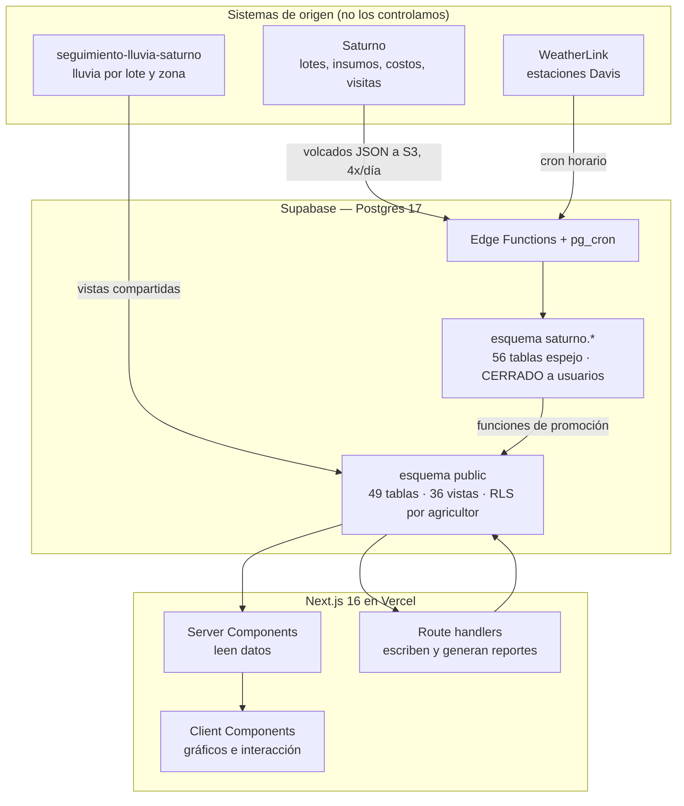
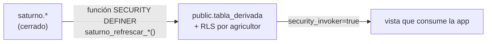
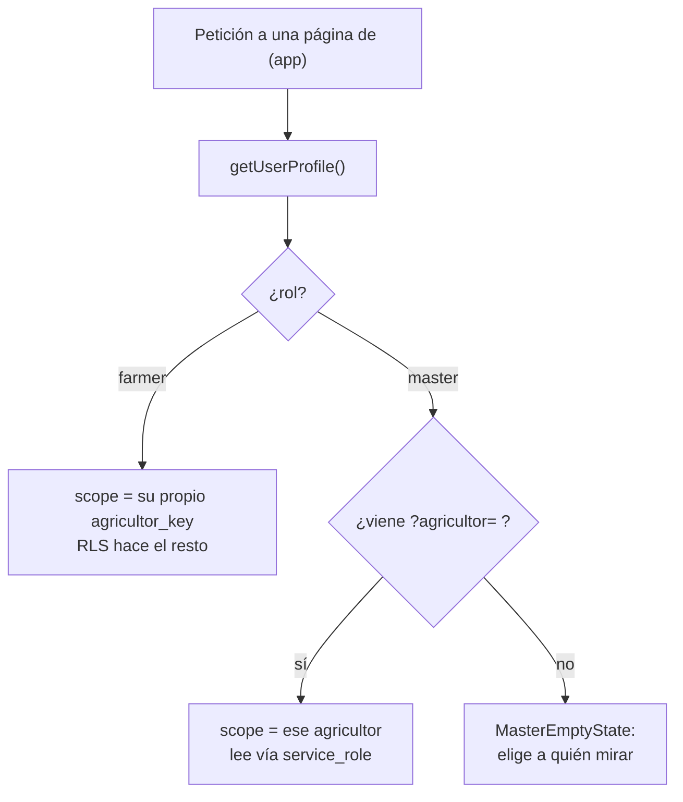

# Arquitectura

Cómo está armado Programa Saturno por dentro: de dónde sale cada dato, quién puede verlo
y por qué las piezas están donde están.

Para el mapa de la interfaz, ver [COMPONENTES.md](COMPONENTES.md).
Para las reglas al escribir código, ver [`AGENTS.md`](../AGENTS.md).

---

## 1. Vista de conjunto



**La app no es dueña de casi ningún dato.** Salvo lo que el usuario escribe explícitamente
(fechas de siembra corregidas, documentos, tickets), todo se espeja desde sistemas de
origen. Antes de "arreglar" un hueco de datos, hay que comprobar si el hueco ya viene del
origen.

---

## 2. Las tres fuentes de datos

### 2.1 Saturno — datos operativos

Es **la fuente de la verdad** de lotes, agricultores, insumos, mecanización, visitas
técnicas y costos.

Llega como volcados JSON a un bucket S3 que vive en **otro proyecto Supabase**
(`nwouogywyofnvxsgjttd`), no en el nuestro. Las credenciales están en **Vault**
(`saturno_config()`), nunca en el repo ni en variables de entorno.

```
S3 (proyecto ajeno) → edge function saturno-sync → esquema saturno.* → funciones de promoción → public.*
                                                    cron: 20 5,11,17,23 (cada 6 h)
```

Detalle completo en [SINCRONIZACION_SATURNO.md](SINCRONIZACION_SATURNO.md).

### 2.2 WeatherLink — clima propio

El único dato que la app captura por sí misma. Estaciones Davis → `weather_readings`,
mediante varias edge functions (`weatherlink-sync`, `wl-load-historic`,
`wl-sync-bulk`) coordinadas por cron.

- Cómo funciona la API y por qué el pipeline está diseñado así (generaciones de sensores,
  rate limiting, incidentes reales): [INTEGRACION_WEATHERLINK.md](INTEGRACION_WEATHERLINK.md).
- Cómo operarlo día a día: [OPERACION_PIPELINE_CLIMA.md](OPERACION_PIPELINE_CLIMA.md).

### 2.3 seguimiento-lluvia-saturno — lluvia por lote

Proyecto aparte, integrado en `/clima` mediante vistas compartidas
(`vista_prediccion_lluvia_lote`, `vista_lluvia_mensual_zona`, …) y el puente
`agricultor_lluvia_map`, que traduce `agropecuaria.AgricultorKey` → `agricultores.id`.
**El puente es por id, nunca por nombre.**

---

## 3. La regla que más caro ha costado: `saturno` está cerrado

El esquema `saturno` no tiene políticas RLS ni `USAGE` para el rol `authenticated`.
Las vistas de `public` llevan `security_invoker = true`, o sea que **corren con los
permisos de quien consulta**.

> Una vista de `public` que cruce `saturno.*` devuelve **cero filas** a cualquier
> agricultor — aunque a ti, consultando con el MCP (`service_role`), te devuelva
> todas.

Esto ya pasó en producción: `v_lote_detalle` cruzaba `saturno.seguimiento` y
`saturno.mecanizacion_registro`, y **todos los agricultores veían "0 lotes"**. No se
detectó antes porque las pruebas se hicieron con `service_role`.

**El patrón correcto**, y el que hay que seguir:



Ejemplos vivos: `lote_derivado` (fase, última visita, encalado, avance) y `pl_unidad`
(costos del P&L). Ambas se rellenan dentro de `saturno_promover_lotes()`.

**Al probar una vista, adopta la identidad de un agricultor:**

```sql
do $$ declare v_uid uuid; begin
  select user_id into v_uid from user_profiles where agricultor_key='<KEY>' limit 1;
  perform set_config('request.jwt.claims',
    json_build_object('sub', v_uid::text, 'role','authenticated')::text, true);
  perform set_config('role','authenticated', true);
end $$;
select count(*) from public.v_lote_detalle;
```

---

## 4. Acceso: dos roles, un solo código

No hay páginas separadas por rol. `lib/access.ts` resuelve **sobre qué agricultor**
está parada la petición:



El master funciona como **consola de validación**: no ve un panel distinto, ve
exactamente lo que ve el agricultor. Por eso `?agricultor=` se propaga entre pantallas.

**Las escrituras nunca aflojan RLS.** Van por un route handler que verifica el rol y
usa `createServiceClient()`. Ejemplo canónico: [`app/api/lote/siembra/route.ts`](../app/api/lote/siembra/route.ts).

---

## 5. Capas del código

| Carpeta | Responsabilidad | No debe |
|---|---|---|
| `app/(app)/*/page.tsx` | Server Components: piden datos y componen la pantalla | Contener lógica de negocio ni `<h1>` (el título vive en la cabecera fija) |
| `app/api/*/route.ts` | Escrituras y generación de reportes | Existir para lecturas simples — eso lo hace el Server Component |
| `lib/*.ts` | Acceso a datos y reglas de negocio | Importar React |
| `components/*.tsx` | Presentación e interacción | Consultar la base directamente |

### Qué hay en `lib/`

| Archivo | Qué resuelve |
|---|---|
| `access.ts` | Sobre qué agricultor está parada la petición (farmer vs master) |
| `auth.ts` | Perfil y sesión del usuario |
| `ciclo.ts` | Ciclo agrícola activo. `resolveCiclo()` ignora la URL a propósito |
| `clima.ts` | Condiciones actuales y series de temperatura desde `v_clima_efectivo` |
| `seguimiento-lluvia.ts` + `-calc.ts` | Lluvia por lote y zona (proyecto integrado) |
| `documentos.ts` | Categorías del archivo y sus reglas |
| `productorhub-storage.ts` | Reenvío de documentos al bucket externo |
| `asistente.ts` | Asistente **determinista**, sin IA externa |
| `agro-glosario.ts` | Vocabulario agronómico y catálogo de módulos |
| `corn-stages.ts` | Etapas fenológicas del maíz (V1..V12, R1..R6) |
| `freshness.ts` | Cuán viejo es un dato, para avisar en pantalla |
| `predictor.ts` | Predictor de siembra (retirado de la UI, código conservado) |

---

## 6. Decisiones que hay que respetar

### Fechas de Saturno: `MM/DD/YYYY`

Formato de EE. UU., **verificado empíricamente** cruzando lotes de 2025: Saturno decía
`04/12/2025` y la app mostraba "sábado, 12 de abril de 2025". Leerlas como `DD/MM`
corre cada cultivo unos 8 meses. Usar siempre `public.saturno_fecha(text)`.

### Nada de `DISTINCT ON` contra `weather_readings`

Impide usar el índice `(station_id, ts DESC)` y obliga a escanear decenas de miles de
filas. Usar `cross join lateral (... order by ts desc limit 1)`. Ese cambio llevó
`v_clima_efectivo` de **2.374 ms a 27 ms**.

### El clima sin estación se muestra vacío, no estimado

Hasta el 30-jul-2026, quien no tenía estación Davis recibía una estimación por IDW desde
las tres estaciones más cercanas (hasta 200 km). En pantalla eso se leía igual que una
medición del propio lote.

Con las estaciones ya asignadas, la triangulación se retiró **en el `CASE` de
`v_clima_efectivo`** (migración `clima_sin_triangulacion`), no en el front: la fuente se
lee desde esa vista en varios sitios —`lib/clima.ts` y los chips de `/master`— y parchear
cada uno deja el riesgo de olvidar el siguiente que se escriba.

La RPC `triangulate_clima()` y las coordenadas se conservan intactas: revertir es reponer
una rama del `CASE`.

### Cómo se asigna la estación a un agricultor

`v_clima_efectivo` prueba cuatro estrategias, **en este orden**:

| Orden | `match_type` | Cómo empareja | Hoy |
|---|---|---|---|
| 1 | `override` | Fila manual en `mapa_productor_clima` | 33 |
| 2 | `auto_codigo_up` | `sync_status.station_name` ↔ `unidad_produccion.codigo_up` | 7 |
| 3 | `herencia_ciclo` | Perfil gemelo del mismo productor en el otro ciclo | 2 |
| 4 | `codigo_de_lote` | `station_name` ↔ código derivado de `lote.unidad_produccion_id` | 3 |

**Por qué existe el paso 4:** `unidad_produccion.codigo_up` trae un `AUTO-0xx` generado en
bastantes perfiles, así que nunca puede emparejar con `G14-La Vilereña-Saturno`. El código
real sí está en `lote.unidad_produccion_id`. Es el mismo problema que obligó a mapear el
P&L por `codigo_up` contra `public.lote`.

**Por qué va el último y no el primero:** medido antes de aplicarlo, darle prioridad
reasignaba la estación de **31 agricultores que ya la tenían bien**. Como último recurso
son 0 conflictos y 3 recuperados.

El emparejamiento lleva `btrim()` en ambos lados porque hay estaciones con espacios
alrededor del guion (`G08 - La Mata - Saturno` → `'G08 '`).

Estado actual: **45 agricultores con estación Davis, 10 sin datos.**

De esos 10, siete tienen lotes con un código de unidad de producción real
(`S01`, `P13`, `P20`, `P21`, `P25`, `G15`, `G19`) para el que **no existe estación en el
catálogo de WeatherLink** — el catálogo tiene 45 y llega hasta `P19` / `G14`. Los otros
tres no tienen lotes: son perfiles residuales.

### El asistente no tiene IA

`lib/asistente.ts` lee datos reales y responde con textos del glosario. Si no entiende,
lo admite. No se le conecta un modelo: no hay API key y no debe inventar cifras.
Al agregar una pantalla, añadirla a `MODULOS` en `lib/agro-glosario.ts` o el asistente
no sabrá que existe.

### PWA: el middleware no puede tocar `/sw.js`

Si el middleware lo intercepta, el navegador recibe una redirección a `/login` en vez del
archivo, el service worker **no puede actualizarse nunca**, y quien instaló la PWA queda
servido por un worker viejo de forma permanente — mientras el dueño del proyecto, que
entra por navegador normal, ve todo bien. Resuelto en el `matcher` de `middleware.ts`.

Las rutas `/api/*` devuelven **401 JSON** en vez de redirigir a HTML, para que el cliente
pueda distinguir "sesión caducada" de "error del servidor".

---

## 7. Automatismos activos

| Job | Frecuencia | Qué hace |
|---|---|---|
| `saturno-sync-6h` | `20 5,11,17,23` | Trae los volcados de Saturno desde S3 |
| `sync-weatherlink-hourly` | cada hora | Lecturas nuevas de las estaciones Davis |
| `wl-load-historic-runner` | cada minuto | Procesa la cola de carga histórica |
| `enqueue-incomplete-months-daily` | `0 3 * * *` | Encola meses de clima incompletos |
| `trueup-sync-counters` | `40 4 * * *` | Cuadra los contadores de sincronización |
| `refrescar-lluvia-diaria` | cada 15 min | Refresca la lluvia diaria por lote |

Salud de la sincronización:

```sql
select * from public.v_saturno_salud;
```

---

## 8. Deploy, y por qué a veces no sale a producción

`main` despliega solo a Vercel. No hay staging: lo que entra en `main` sale a producción.

**Vercel, en plan Hobby, bloquea el deploy cuando el autor del commit no es colaborador
del proyecto.** El deploy queda en `Blocked` con el mensaje *"the commit author did not
have contributing access"*. En la práctica: el trabajo de un colaborador externo se
mergea bien en GitHub pero **no llega a producción**.

La solución no es reescribir su autoría: basta con que **el commit de cabecera sea de la
cuenta dueña del proyecto**. Al empujar cualquier commit encima, el deploy pasa y arrastra
todo lo anterior. La alternativa real es pasar a plan Pro y añadirlo como miembro.

### Verificar un deploy sin iniciar sesión

Casi toda la app está detrás del login. El truco es `/sw.js`, que es público y cuyo
manifest lista los chunks del build que está vivo:

```bash
curl -s https://agri-platform-omega.vercel.app/sw.js | grep -oE 'chunks/app/\(app\)/[a-z]+/page-[a-f0-9]+\.js'
```

Con ese nombre, se descarga el chunk de `/_next/static/…` y se busca dentro la cadena del
cambio (un texto, una clase de Tailwind, un valor como `[10,40]`).

Dos advertencias que ya causaron verificaciones inválidas:

1. **Los hashes del build local no sirven.** Vercel compila en Linux y con otra
   normalización de fin de línea, así que los nombres de chunk difieren y pedirlos da 404.
   El nombre tiene que salir del propio deploy.
2. **Un marcador solo vale si discrimina.** Buscar algo que ya existía en el build
   anterior no prueba nada. Comprobar siempre qué decía la versión previa.

---

## 9. Pendientes conocidos

- **Rotar las credenciales S3 de Saturno**: llegaron por WhatsApp en texto plano.
- **Rotar las contraseñas de prueba** de agricultores y master antes de un despliegue real.
- **Contraste del hero en `/login`**: 1.89:1, por debajo del mínimo WCAG de 3.0.
- **Botón de mostrar contraseña**: 16×16 px, por debajo del área táctil recomendada.
- **Siete agricultores sin estación pese a tener lotes**: sus unidades de producción son
  `S01`, `P13`, `P20`, `P21`, `P25`, `G15` y `G19`, y no existe estación con esos códigos
  en WeatherLink. El catálogo local está sano (45 estaciones, todas sincronizadas dentro
  de la última hora), así que no es un problema del pipeline: o esas estaciones no están
  dadas de alta en la cuenta, o figuran con otro nombre. Confirmar con el equipo de campo.
- **Lotes faltantes** de Héctor Pérez y Miguel Tohme: confirmar con el equipo de datos si
  el hueco viene del origen. Ambos tienen usuario pero cero lotes.
- **Perfiles duplicados de la misma persona**: "Marco Fantinel Furlanis" (ciclo 2025, sin
  lotes ni usuario) y "Celso Fantinel Furlanis" (ciclo 2026, 10 lotes) son el mismo
  productor. `public.agropecuaria` **no** se repuebla desde el espejo —ninguna función de
  promoción escribe en ella— así que una consolidación local sobrevive al sync. La
  herencia por nombre (`herencia_ciclo`) no los une porque los nombres de pila difieren.
- **Confirmar la definición de "Ha encaladas"**: hoy se deriva sumando la mecanización de
  tipo `Pase de encaladora`.
