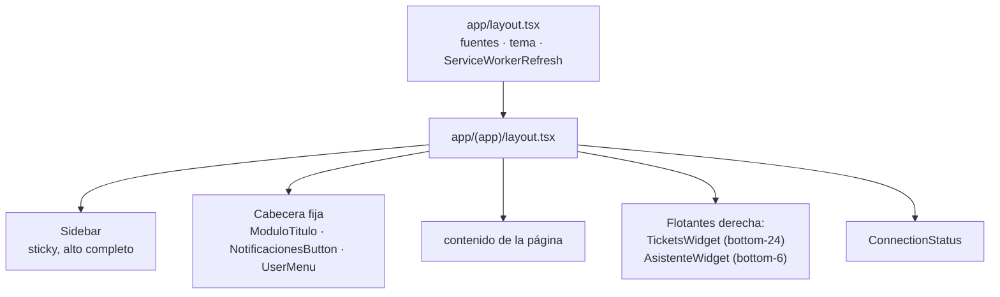

# Componentes

Mapa de la interfaz: qué pantalla monta qué, y qué hace cada pieza.

Para el flujo de datos y las decisiones de fondo, ver [ARQUITECTURA.md](ARQUITECTURA.md).

---

## Convenciones

- **Server Components por defecto.** `'use client'` solo cuando hace falta estado,
  efectos o eventos. Todas las páginas de `app/(app)/` son Server Components.
- **Los componentes no consultan la base.** Reciben datos por props. Quien consulta es
  la página (Server Component) o un handler en `app/api/`.
- **El `<h1>` vive en la cabecera fija** (`ModuloTitulo`), no en las páginas. Poner uno
  en una página produce título duplicado.
- **Cada ruta tiene su `loading.tsx`** con esqueleto (`Skeleton`, `LoadingCampo`). Sin él
  la navegación se percibe como colgada.
- Textos de interfaz **en español**.

---

## Estructura del layout

`Sidebar` es `sticky top-0 h-screen`, de modo que "Cerrar sesión" (`mt-auto`) queda
anclado abajo aunque la página sea larga.

---

## Por pantalla

### `/dashboard`

| Componente | Qué muestra |
|---|---|
| `AvanceCultivoChart` | Avance del ciclo promediado **solo sobre lotes ya sembrados** (los sin sembrar no arrastran el promedio) + distribución por tramos |
| `NotificacionesButton` | Centro de novedades. Cada novedad lleva **enlace al sitio donde se resuelve** (documento → Documentación, clima → Clima, cambio de siembra → Cultivo) |
| `EstadoLotesCard` | Distribución del estado general por lote |
| `FaseActualCard` | Fase fenológica dominante entre los lotes |
| `MisComunicaciones` | Últimos documentos cargados |
| `ClimateSparkline` | Miniserie de temperatura y humedad |

> **Cuidado con la cosecha:** en el ciclo activo puede no haber ningún lote cosechado.
> Por eso el dashboard grafica avance de ciclo y no cosecha — un gráfico de cosecha
> saldría plano en cero.

### `/clima`

Módulo reescrito por **Alejandro Cifuentes** (jul-2026), integrando el proyecto
`seguimiento-lluvia-saturno`. Vive en `components/clima/`.

**Vista del agricultor**

| Componente | Qué muestra |
|---|---|
| `StatCardRow` | 4 KPIs sobre los lotes en seguimiento |
| `TemperatureChart` | Temperatura diaria de la estación asignada. Eje Y fijo **10–40 °C** para que sea comparable entre lotes y una variación de dos grados no se vea exagerada |
| `LoteRainChart` / `LotesRainGrid` | Lluvia acumulada por lote durante su periodo crítico |
| `AgricultorRainMonthlyChart` | Lluvia mensual del agricultor, un año por serie |
| `RainProgressBar` | Lluvia acumulada contra la meta en mm |
| `DryStreakBadge` | Racha de días secos consecutivos, con color escalado a partir de 3 |
| `CurrentConditionsCard` | Lectura más reciente. **Único punto donde se usa HeroUI v3** (piloto) |

**Vista master** (`components/clima/master/`)

| Componente | Qué muestra |
|---|---|
| `ClimaVistaTabs` | Pestañas que escriben `?vista=` conservando el resto de parámetros |
| `GlobalAgricultoresTable` | Ranking de lotes de todos los agricultores |
| `PorAgricultorAccordion` | Un `
` desplegable por agricultor |
| `ZonasComparisonSection` | Lluvia mensual histórica pivoteada por zona |
| `DistribucionProbabilidadChart` | Curva de densidad normal de la lluvia del periodo crítico |
| `EstadoLlenadoBadge`, `ProgressBar` | Indicadores de apoyo |

`chartTheme.ts` centraliza colores y `prediccionMensual.ts` el cálculo de predicción.

> Quien **no tiene estación Davis** ve el módulo vacío, no una estimación.
> Ver [decisión](ARQUITECTURA.md#el-clima-sin-estación-se-muestra-vacío-no-estimado).

### `/cultivo`

| Componente | Qué muestra |
|---|---|
| `CultivoTimeline` | Línea de tiempo anual del ciclo: marcador "Hoy", 6 etapas de crecimiento (`CornStage`) y barra de 12 meses |
| `CornStage` | SVG de la planta de maíz en una etapa dada |
| `IrrigationRing` | Anillo de estado de riego |
| `UltimaVisitaCard` | Última visita técnica, tal como la registró el técnico en Saturno |
| `FechaSiembraEditor` | Corrección manual de la fecha de siembra (**solo master**), con confirmación y registro en novedades |

> **Orden vertical del timeline:** franja superior (marcador "Hoy" + plantas) → barra de
> meses → indicador del ciclo. Las plantas se apoyan en la base de **su propia franja**,
> no del panel: cuando se anclaban al panel completo aparecían por debajo de los meses.

### `/documentacion`

| Componente | Qué muestra |
|---|---|
| `DocumentoCategoriaTabs` | Navegación entre las categorías del archivo |
| `DocumentosSection` | Grilla de documentos de la categoría activa |
| `DocumentoCard` | Tarjeta de un documento |
| `DocumentoAcciones` | Ver (modal) · Descargar · Eliminar |
| `DocumentoPreviewModal` | Previsualización, pidiendo una signed URL fresca al abrir |
| `DocumentoDownloadBtn` / `DocumentoDeleteBtn` | Descarga y borrado (borrar: solo master) |
| `DocumentoUploader` | Carga múltiple drag & drop (**solo master**) |
| `DescargarPLBtn` | **Extra:** estado de resultados en Excel. Va fuera de las pestañas y separado por una línea, porque no es un documento cargado por nadie sino un reporte generado al vuelo desde los costos de Saturno |

### `/master`

Consola de validación: tabla de agricultores con chips de cobertura (clima, lotes,
documentos) y acceso directo a la vista de cada uno.
`MasterAgricultorSelector` y `MasterEmptyState` se comparten con las demás pantallas.

---

## Transversales

| Componente | Para qué |
|---|---|
| `Sidebar` | Navegación. Propaga `?agricultor=` entre pantallas |
| `ModuloTitulo` | Título del módulo en la cabecera fija |
| `UserMenu` | Menú de usuario del header |
| `ThemeToggle` | Claro / oscuro |
| `TicketsWidget` | Buzón de preguntas para responder en diferido (`bottom-24 right-6`) |
| `AsistenteWidget` | Asistente **determinista**, sin IA (`bottom-6 right-6`) |
| `ConnectionStatus` | Banner cuando se pierde la conexión |
| `ServiceWorkerRefresh` | Fuerza la comprobación de actualizaciones de la PWA al abrir |
| `LoadingCampo` | Animación de marca: una planta de maíz germinando |
| `Skeleton` | Primitivas para los `loading.tsx` |
| `DataSourceBadge` | De dónde viene el dato de clima |
| `ReportButtons`, `DescargarHistoricoClimaBtn` | Exportables (Excel / PDF / histórico) |

**Retirados de la interfaz, código conservado:** `PredictorSiembraPanel` (junto con
`lib/predictor.ts`).

---

## Añadir una pantalla nueva

1. `app/(app)/<ruta>/page.tsx` como Server Component, con `export const dynamic = 'force-dynamic'`
   si muestra datos vivos.
2. Su `loading.tsx` con esqueleto.
3. Entrada en `farmerLinks` (o `masterLinks`) de `Sidebar.tsx`.
4. Entrada en `MODULOS` de `lib/agro-glosario.ts`, **o el asistente no sabrá que existe**.
5. Si reemplaza una ruta anterior, un redirect en `next.config.ts`: hay marcadores y
   atajos de PWA instalados apuntando a las rutas viejas.
